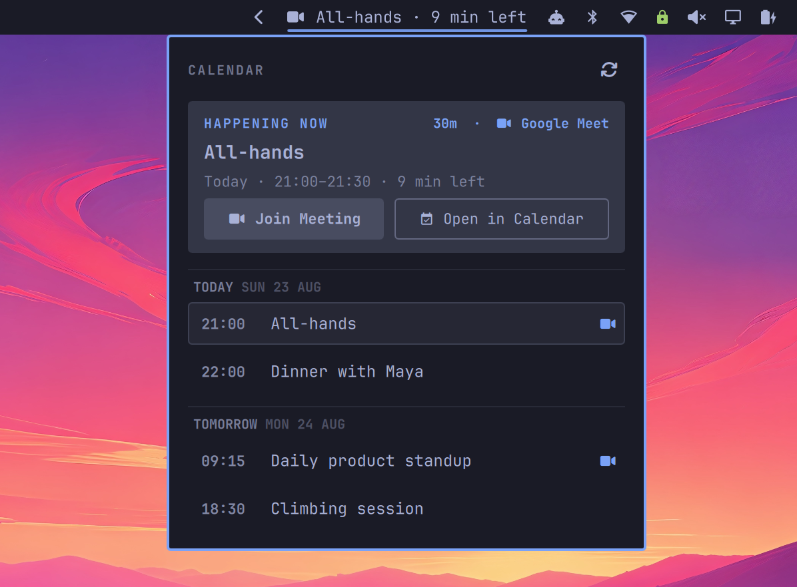

# Caldir widget for Omarchy

⚡ Lightning-fast access to your next calendar events in the Omarchy bar. Works great with [renCal](https://rencal.org).



## Features

- Supports all major calendar providers (Google Calendar, iCloud, Outlook, CalDAV...) through [caldir](https://caldir.org).
- Uses vim motions (<kbd>h</kbd>, <kbd>j</kbd>, <kbd>k</kbd>,<kbd>l</kbd>) for navigation.
- Highlights the next meeting when it's close to start.
- One-click action. Meeting events (Google Meet, Zoom, etc) open the video URL in your browser. Non-meeting events open in [renCal](https://rencal.org).
- Syncs automatically (or trigger manually with <kbd>s</kbd>).

## Installation

```sh
omarchy plugin add https://github.com/t4t5/omarchy-caldir-widget --enable
```

This will add the widget to `~/.config/omarchy/shell.json` as:

```json
{
  "id": "org.ren.caldir"
}
```

The widget uses [caldir-cli](https://caldir.org) to read your calendar data (requires v0.12.1 or higher).

## Usage

See the caldir docs for [how to connect a calendar](https://caldir.org/quickstart/).

It is also recommended to have [renCal](https://rencal.org) installed, so that you can view and edit your caldir events through a GUI.

### Shortcuts

Set a key binding in `~/.config/hypr/bidnings.lua` to open the widget more quickly:

```lua
-- Toggle caldir widget
o.bind("SUPER + SHIFT + C", "Caldir widget", "omarchy shell org.ren.caldir toggle")
```

### IPC

```sh
omarchy shell org.ren.caldir toggle
omarchy shell org.ren.caldir open
omarchy shell org.ren.caldir close
omarchy shell org.ren.caldir refresh
```

## Settings

Set your preferences in `~/.config/omarchy/shell.json`:

```json
{
  "id": "org.ren.caldir",
  "daysAhead": 3
}
```

| Setting | Default | Purpose |
| --- | ---: | --- |
| `daysAhead` | `2` | Number of future schedule days to display |

### Customizing event opening

By default, events with a detected video link open that link; everything else
opens in renCal through a deeplink. The **Join Meeting** button and a
right-click on the bar join the next meeting, while **Open in Calendar** always
opens renCal.

To customize this behavior, create
`~/.config/omarchy/caldir/open.lua` and define `on_open`:

```lua
function on_open(event, action)
  if action == "join" then
    exec { "start-transcription", "--title", event.title }
  end
  default_open(event, action)
end
```

The file does not need to be executable. Errors appear as desktop
notifications, and calling `default_open` at the end keeps the stock behavior.

The hook receives an `event` table. Every field is `nil` when absent:

| Field | Value |
| --- | --- |
| `uid` | Event UID |
| `instance_id` | Instance ID; recurring instances use `<uid>__<recurrence-id>` |
| `title` | Event title |
| `conference_url` | Detected, unwrapped video URL |

Four global helper functions are available:

| Function | Behavior |
| --- | --- |
| `default_open(event, action)` | Runs the bundled `join` or `calendar` policy |
| `open_url(url)` | Opens a URL through `xdg-open` |
| `open_rencal(event)` | Builds and opens the event's renCal deeplink |
| `exec(command)` | Runs a command in the background; pass an argument table for shell-safe quoting or a shell command string |

Use `--print` to see what a hook would run without executing anything.
`OPEN_EVENT_CONFIG` lets you try a hook at another path:

```sh
EVENT_TITLE='Team sync' \
EVENT_CONFERENCE_URL='https://meet.example.test/team-sync' \
OPEN_EVENT_CONFIG=./my-open.lua \
bin/open-event --print join
# exec 'start-transcription' '--title' 'Team sync'
# open https://meet.example.test/team-sync
```

The default handler does not guess at a calendar provider or open a web
calendar fallback when `xdg-open` rejects a renCal deeplink. Install renCal or
use `open.lua` when a different policy is wanted.

## Contributing

For local development, we use a [justfile](https://just.systems/man/en/) for developer commands.

Install the locally cloned repo in your Omarchy bar to test:

```sh
just install
```

When making changes, you can reload it with:

```sh
just reload
```

To remove the plugin:

```sh
just uninstall
```

Before submitting a PR, ensure everything runs with `just test`.
